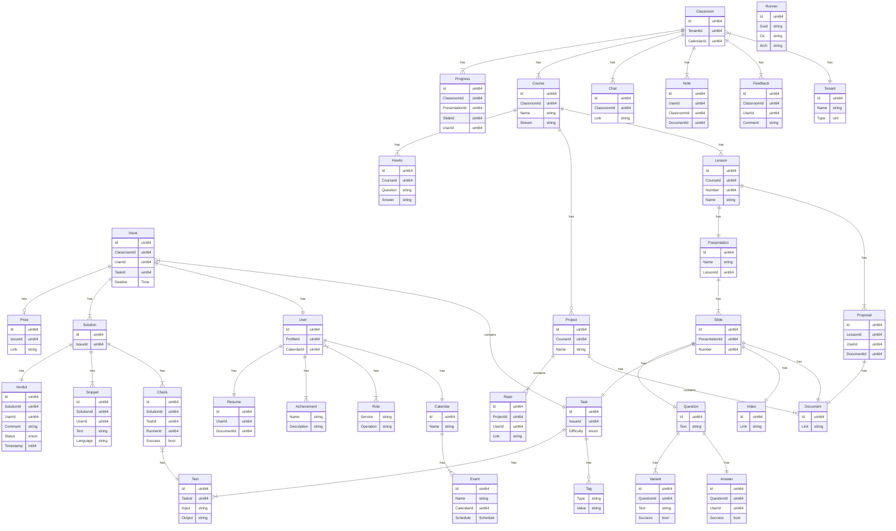

```mermaid
erDiagram
          User ||--|| Calendar: has
          Calendar ||--|{ Event: has
          User }|--|{ Role: has
          Issue }|--|| Task: contains
          Issue ||--|| User: has
          Issue ||--|{ Solution: has
          Task ||--o{ Tag: has
          Task ||--|{ Test: has
          Solution ||--|{ Check: has
          Solution ||--|{ Snippet: has
          Solution ||--|| Verdict: has
          Check }|--|| Test: has
          Course ||--|{ Lesson: has
          Course ||--o{ Project: has
          Course ||--|{ Howto: has
          Classroom }|--|| Tenant: has
          Classroom ||--|{ Feedback: has
          Classroom ||--|{ Note: has
          Classroom ||--|{ Chat: has
          Classroom ||--|{ Course: has
          Classroom || -- |{ Progress: has
          Lesson ||--|{ Proposal: has
          Lesson ||--|| Presentation: has
          Presentation ||--|{ Slide: has
          Slide ||--|| Document: has
          Slide ||--|| Video: has
          Slide ||--|| Task: has
          Issue ||--o| Prize: has
          Project ||--|{ Document: contains
          Project ||--|{ Repo: contains
          Proposal ||--|| Document: has
          Slide ||--|| Question: has
          Question ||--|| Answer: has
          Question ||--|{ Variant: has
          User ||--|{ Achievement: has
          User ||--|| Resume: has
          Calendar {
            Id uint64
            Name string
          }
          Event {
            Id uint64
            Name string
            CalendarId uint64
            Schedule Schedule
          }
          User {
            Id uint64
            ProfileId uint64
            CalendarId uint64
          }
          Tag {
            Type string
            Value string
          }
          Resume {
            Id uint64
            UserId uint64
            DocumentId uint64
          }
          Achievement {
            Name string
            Description string
          }
          Slide {
            Id uint64
            PresentationId uint64
            Number uint64
          }
          Role {
            Service string
            Operation string
          }
          Howto {
            Id uint64
            CourseId uint64
            Question string
            Answer string
          }
          Question {
            Id uint64
            Text string
          }
          Repo {
            Id uint64
            ProjectId uint64
            UserId uint64
            Link string
          }
          Answer {
            Id uint64
            QuestionId uint64
            UserId uint64
            Success bool
          }
          Variant {
            Id uint64
            QuestionId uint64
            Text string
            Success bool
          }
          Progress {
            Id uint64
            ClassroomId uint64
            PresentationId uint64
            SlideId uint64
            UserId uint64
          }
          Presentation {
            Id uint64
            Name string
            LessonId uint64
          }
          Verdict {
            Id uint64
            SolutionId uint64
            UserId uint64
            Comment string
            Status enum
            Timestamp int64
          }
          Check {
            Id uint64
            SolutionId uint64
            TestId uint64
            RunnerId uint64
            Success bool
          }
          Runner {
            Id uint64
            Guid string
            Os string
            Arch string
          }
          Video {
            Id uint64
            Link string
          }
          Chat {
            Id uint64
            ClassroomId uint64
            Link string
          }
          Course {
            Id uint64
            ClassroomId uint64
            Name string
            Stream string
          }
          Project {
            Id uint64
            CourseId uint64
            Name string
          }
          Feedback {
            Id uint64
            ClassroomId uint64
            UserId  uint64
            Comment string
          }
          Document {
            Id uint64
            Link string
          }
          Note {
            Id uint64
            UserId uint64
            ClassroomId uint64
            DocumentId uint64
          }
          Lesson {
            Id uint64
            CourseId uint64
            Number uint64
            Name string
          }
          Classroom {
            Id uint64
            TenantId uint64
            CalendarId uint64
          }
          Tenant {
            Id uint64
            Name string
            Type uint
          }
          Issue {
            Id uint64
            ClassroomId uint64
            UserId uint64
            TaskId uint64
            Dealine Time
          }
          Solution {
            Id uint64
            IssueId uint64
          }
          Task {
            Id uint64
            IssueId uint64
            Difficulty enum
          }
          Test {
            Id uint64
            TaskId uint64
            Input string
            Output string
          }
          Proposal {
            Id uint64
            LessonId uint64
            UserId uint64
            DocumentId uint64
          }
          Prize {
            Id uint64
            IssueId uint64
            Link     string
          }
          Snippet {
            Id uint64
            SolutionId uint64
            UserId uint64
            Text string
            Language string
          }
```
