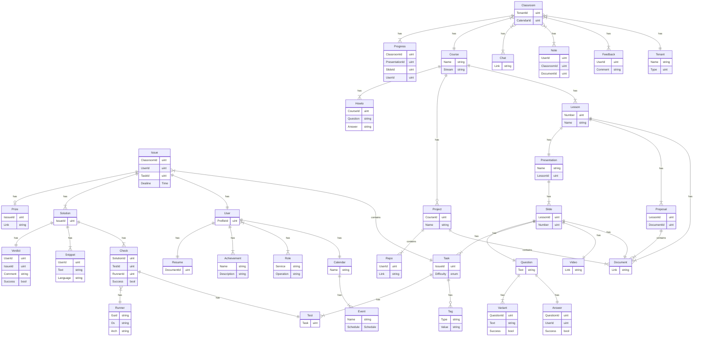

```mermaid
erDiagram
          User ||--|| Calendar: has
          Calendar ||--|{ Event: has
          User }|--|{ Role: has
          Issue }|--|| Task: contains
          Issue ||--|| User: has
          Issue ||--|{ Solution: has
          Task ||--o{ Tag: has
          Task ||--|{ Test: has
          Solution ||--|{ Check: has
          Solution ||--|{ Snippet: has
          Solution ||--|| Verdict: has
          Check ||--|| Test: has
          Course ||--|{ Lesson: has
          Course ||--o{ Project: has
          Course ||--|{ Howto: has
          Lesson ||--|{ Document: has
          Classroom }|--|| Tenant: has
          Classroom }|--|{ Feedback: has
          Classroom }|--|{ Note: has
          Classroom }|--|{ Chat: has
          Classroom }|--|| Course: has
          Classroom || -- |{ Progress: has
          Lesson ||--|{ Proposal: has
          Lesson ||--|| Presentation: has
          Presentation ||--|{ Slide: has
          Slide ||--|| Document: has
          Slide ||--|| Video: has
          Slide ||--|{ Task: has
          Check }|--|| Runner: has
          Issue ||--o| Prize: has
          Project ||--|{ Document: contains
          Project ||--|{ Repo: contains
          Proposal ||--|{ Document: contains
          Slide ||--|| Question: has
          Question ||--|| Answer: has
          Question ||--|{ Variant: has
          User ||--|{ Achievement: has
          User ||--|| Resume: has
          Calendar {
            Name string
          }
          Event {
            Name string
            Schedule Schedule
          }
          User {
            ProfileId uint
          }
          Tag {
            Type string
            Value string
          }
          Resume {
            DocumentId uint
          }
          Achievement {
            Name string
            Description string
          }
          Slide {
            LessonId uint
            Number uint
          }
          Role {
            Service string
            Operation string
          }
          Howto {
            CourseId uint
            Question string
            Answer string
          }
          Question {
            Text string
          }
          Repo {
            UserId uint
            Link string
          }
          Answer {
            QuestionId uint
            UserId uint
            Success bool
          }
          Variant {
            QuestionId uint
            Text string
            Success bool
          }
          Progress {
            ClassroomId uint
            PresentationId uint
            SlideId uint
            UserId uint
          }
          Presentation {
            Name string  
            LessonId uint
          }
          Verdict {
            UserId uint
            IssueId uint
            Comment string
            Success bool
          }
          Check {
            SolutionId uint
            TestId uint
            RunnerId uint
            Success bool
          }
          Runner {
            Guid string
            Os string
            Arch string
          }
          Video {
            Link string
          }
          Chat {
            Link string
          }
          Course {
            Name string
            Stream string
          }
          Project {
            CourseId uint
            Name string
          }
          Feedback {
            UserId  uint
            Comment string
          }
          Document {
            Link string
          }
          Note {
            UserId uint
            ClassroomId uint
            DocumentId uint
          }
          Lesson {
            Number uint
            Name string
          }
          Classroom {
            TenantId uint
            CalendarId uint
          }
          Tenant {
            Name string
            Type uint
          }
          Issue {
            ClassroomId uint
            UserId uint
            TaskId uint
            Dealine Time
          }
          Solution {
            IssueId uint
          }
          Task {
            IssueId uint
            Difficulty enum
          }
          Test {
            Task uint
          }
          Proposal {
            LessonId uint
            DocumentId uint
          }
          Prize {
            IsssueId uint
            Link     string
          }
          Snippet {
            UserId uint
            Text string
            Language string
          }
```
